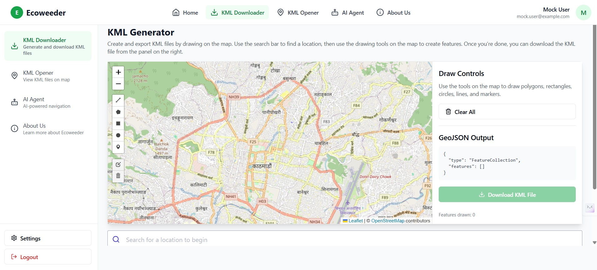
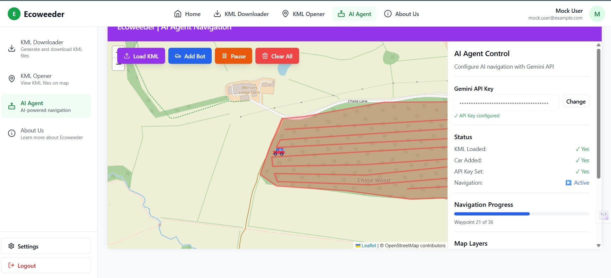

# Ecoweeder - KML Generator & AI Navigation Platform

A comprehensive Next.js application for KML file generation, visualization, and AI-powered navigation using Google Gemini API.

## Features

- 🗺️ **KML Generator**: Interactive map drawing with polygon, rectangle, circle, line, and marker tools
- 📍 **KML Viewer**: Load and visualize KML files on OpenStreetMap
- 🤖 **AI Navigation Agent**: AI-powered vehicle navigation through waypoints
- 🔐 **User Authentication**: Secure login and registration system
- 📱 **Responsive Design**: Modern UI built with Tailwind CSS and shadcn/ui

## Tech Stack

- **Framework**: Next.js 14 with App Router
- **Language**: TypeScript
- **Styling**: Tailwind CSS
- **UI Components**: shadcn/ui with Radix UI
- **Mapping**: Leaflet.js with Leaflet Draw
- **Database**: MongoDB with Prisma ORM
- **Authentication**: bcryptjs
- **AI**: Google Gemini API
- **Robotics**: ROS 2 & Gazebo Integration

## Installation

1. **Clone and install dependencies**:

   ```bash
   git clone https://github.com/your-repo/ecoweeder.git
   cd ecoweeder

   For Linux
   Step 1: enter  "chmod +x start.sh" and press enter.
   Step 2: "./start.sh" and press enter 

   For Windows 
   Step 1: ".\start.ps1" and press enter.
   ```

## 🚀 Running the Simulation (Gazebo/ROS)

To run the full stack including the robot simulation:

1. **Start the App & Bridge**: Run `./start.sh` (Linux) or `.\start.ps1` (Windows). When prompted, type `y` to start the ROS Bridge and Mission Planner.
2. **Start Gazebo**: In a new terminal, run:
   ```bash
   ./simulation/start_sim.sh
   ```
3. **Access Dashboard**: Go to `http://localhost:3000/dashboard/mission-control` to plan missions for the bot.

### ⚠️ Prerequisites for Simulation
- ROS 2 (Humble/Foxy)
- Gazebo
- `rosbridge_suite` (`sudo apt install ros-humble-rosbridge-suite`)

### ⚠️ MongoDB Requirement
Prisma requires a **MongoDB Replica Set** to function correctly. 
- If using **MongoDB Atlas**, this is handled automatically.
- If using **Local MongoDB**, you must convert your standalone instance to a replica set.
- Alternatively, you can use a connection string like `mongodb://localhost:27017/ecoweeder?directConnection=true` for simple local development, but some features may be limited.

3. **Run the development server**:
   ```bash
   npm run dev
   ```

## Usage

- **Authentication**: Register and log in to access the dashboard.
- **KML Generator**: Draw map features and download them as a KML file.
- **KML Viewer**: Upload and visualize KML files.
- **AI Navigation Agent**: Set your Gemini API key, load a KML with waypoints, and start the AI-powered navigation.

## Production Deployment

```bash
npm run build
npm start
```

## Images and Videos




Video:


---

_Proprietary - All rights reserved_
